# Load Balancer Module

Creates a load balancer to distribute traffic across web servers.

## What it creates

- **Load Balancer**: Distributes incoming web traffic
- **Backend Pool**: Group of web servers to handle requests
- **Health Checks**: Automatically removes unhealthy servers
- **Public IP**: Single entry point for users

## How it works

```mermaid
graph TD
    Users([👥 Internet Users<br/>HTTP Requests])
    
    subgraph "Public Subnet"
        LB[ Load Balancer<br/>Public IP<br/>Round Robin<br/>Health Checks]
    end
    
    subgraph "Backend Pool"
        subgraph "Private Subnet" 
            Web1[ Web Server 1<br/>10.0.10.x:80<br/>Healthy]
            Web2[ Web Server 2<br/>10.0.10.x:80<br/>Healthy]
        end
    end
    
    subgraph "Health Monitoring"
        HC[🔍 Health Checker<br/>GET /health<br/>Every 30s<br/>3 retries]
    end
    
    Users --> LB
    LB --> Web1
    LB --> Web2
    
    HC -.->|Monitor| Web1
    HC -.->|Monitor| Web2
    HC -.->|Status| LB
    
    Web1 -.->|Response| Users
    Web2 -.->|Response| Users
    
    classDef users fill:#4CAF50,stroke:#388E3C,stroke-width:2px,color:#fff
    classDef loadbalancer fill:#2196F3,stroke:#1976D2,stroke-width:2px,color:#fff
    classDef webserver fill:#9C27B0,stroke:#7B1FA2,stroke-width:2px,color:#fff
    classDef health fill:#FF9800,stroke:#F57C00,stroke-width:2px,color:#fff
    
    class Users users
    class LB loadbalancer
    class Web1,Web2 webserver
    class HC health
```

## Key Features

- **High availability**: If one server fails, traffic goes to healthy servers
- **Even distribution**: Uses round-robin to balance load
- **Health monitoring**: Checks `/health` endpoint every 30 seconds
- **Flexible bandwidth**: 10-20 Mbps (adjustable based on needs)

## Load Balancing Policy

- **Round Robin**: Requests distributed evenly across all healthy servers
- **Health Checks**: Servers marked unhealthy after 3 failed checks
- **Automatic recovery**: Unhealthy servers automatically added back when healthy

## Files

- `main.tf`: Creates load balancer, backend pool, and health checks
- `variables.tf`: Load balancer configuration options